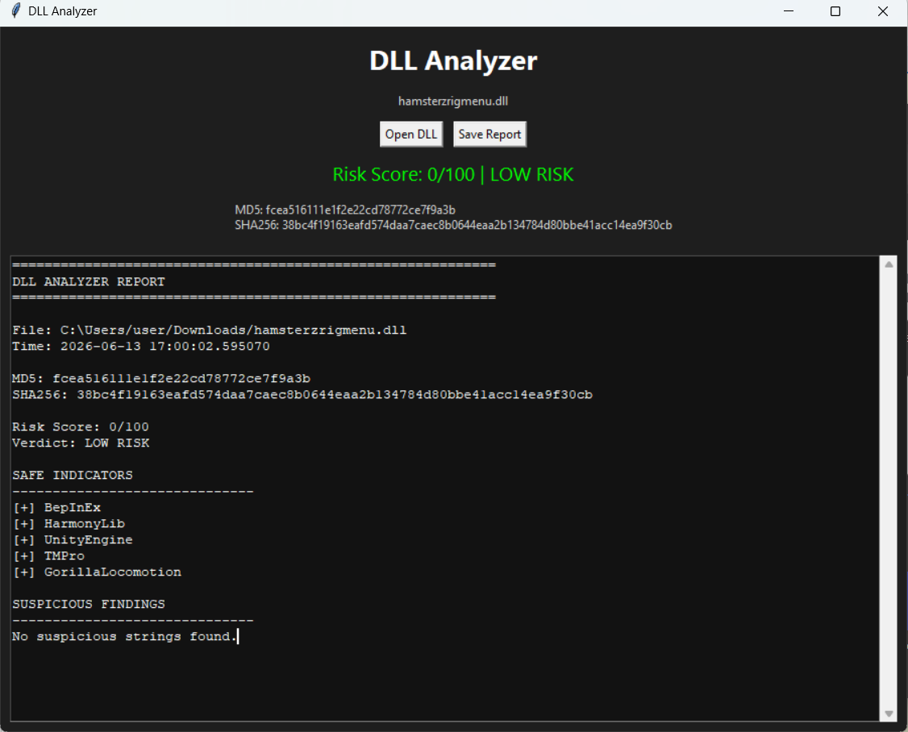

# DLL Analyzer

🔍 A lightweight Windows utility for static DLL and EXE analysis.

DLL Analyzer helps you inspect files by generating hashes, detecting common libraries, searching for suspicious strings, and creating easy-to-read analysis reports.

---

## Features

- SHA256 Hash Generation
- MD5 Hash Generation
- DLL & EXE Support
- Risk Scoring
- Suspicious String Detection
- Common Framework Detection
- Analysis Report Generation
- Report Exporting
- Lightweight & Portable

---

## Screenshot

### Main Window



---

## Download

Download the latest version from the **Releases** section.

Included:

- DLLAnalyzer.exe

No installation required.

---

## How It Works

DLL Analyzer performs **static analysis**.

The file is never executed.

The analyzer:

- Reads file contents
- Generates SHA256 and MD5 hashes
- Searches for suspicious strings
- Detects common libraries and frameworks
- Calculates a risk score
- Generates a detailed report

---

## Example Detection Categories

### Safe Indicators

- BepInEx
- HarmonyLib
- UnityEngine
- TMPro
- GorillaLocomotion
- Photon.Pun

### Suspicious Indicators

- powershell
- cmd.exe
- Process.Start
- WebClient
- HttpClient
- Discord Webhooks
- SharpMonoInjector

---

## Risk Levels

| Score | Verdict |
|---------|----------|
| 0-19 | 🟢 Low Risk |
| 20-49 | 🟡 Moderate Risk |
| 50-79 | 🟠 High Risk |
| 80-100 | 🔴 Critical Risk |

---

## Example Report

```text
DLL ANALYZER REPORT

File: Example.dll

Risk Score: 0/100
Verdict: LOW RISK

SAFE INDICATORS

[+] BepInEx
[+] HarmonyLib
[+] UnityEngine

SUSPICIOUS FINDINGS

No suspicious strings found.
```

---

## Disclaimer

DLL Analyzer is intended for educational and research purposes.

This tool:

- Does not execute analyzed files
- Does not guarantee that a file is safe
- Does not replace antivirus software
- Does not perform behavioral analysis

Always use caution when running files from untrusted sources.

---

## Roadmap

### v1.1

- More suspicious string detection
- Improved risk scoring
- Better report formatting

### v1.2

- PE metadata analysis
- Entropy analysis
- Improved UI

### v2.0

- .NET assembly inspection
- Assembly reference analysis
- Advanced reporting

---

## Built With

- Python
- Tkinter
- hashlib
- PyInstaller

---

## License

MIT License

---

Made by Kiro 😎
